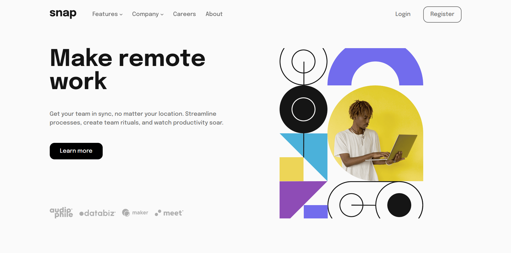

# Frontend Mentor - Intro section with dropdown navigation solution

This is a solution to the [Intro section with dropdown navigation challenge on Frontend Mentor](https://www.frontendmentor.io/challenges/intro-section-with-dropdown-navigation-ryaPetHE5). Frontend Mentor challenges help you improve your coding skills by building realistic projects.

## Table of contents

- [Overview](#overview)
  - [The challenge](#the-challenge)
  - [Screenshot](#screenshot)
  - [Links](#links)
- [My process](#my-process)
  - [Built with](#built-with)
  - [What I learned](#what-i-learned)
  - [Continued development](#continued-development)
- [Author](#author)

## Overview

### The challenge

Users should be able to:

- View the relevant dropdown menus on desktop and mobile when interacting with the navigation links
- View the optimal layout for the content depending on their device's screen size
- See hover states for all interactive elements on the page

### Screenshot

### Links

- Live Site URL: [Github Live Site](https://eyadomar.github.io/intro-section-with-intermediate--nav/)

## My process

### Built with

- Semantic HTML5 markup
- CSS custom properties
- Flexbox
- CSS Grid

### What I learned

This my first time building modern nested dropdown lists, I did built the nested lists in JS and appended them onclicking and styled them as absolute elements. I don't know if It was the best approach but Its was good challnge.

### Continued development

I have big problem with my sidebar in small screens, when I open the sidebar, scoll happens when I press any link the scroll goes away. I tried to fix it But I couldn't so I will take a breather by building another website and I will return to it.

## Author

- Frontend Mentor - [@EyadOmar](https://www.frontendmentor.io/profile/EyadOmar)
- Github - [EyadOmar](https://github.com/EyadOmar)
